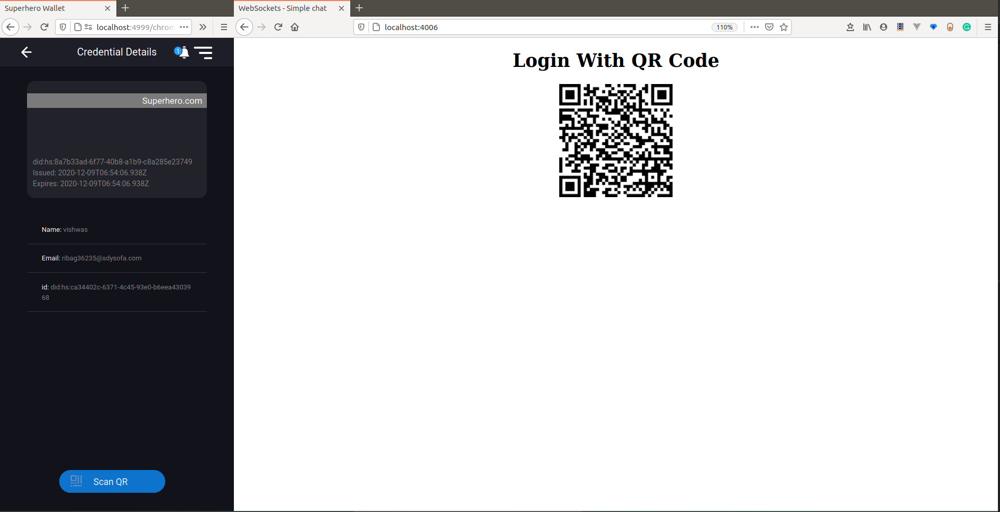
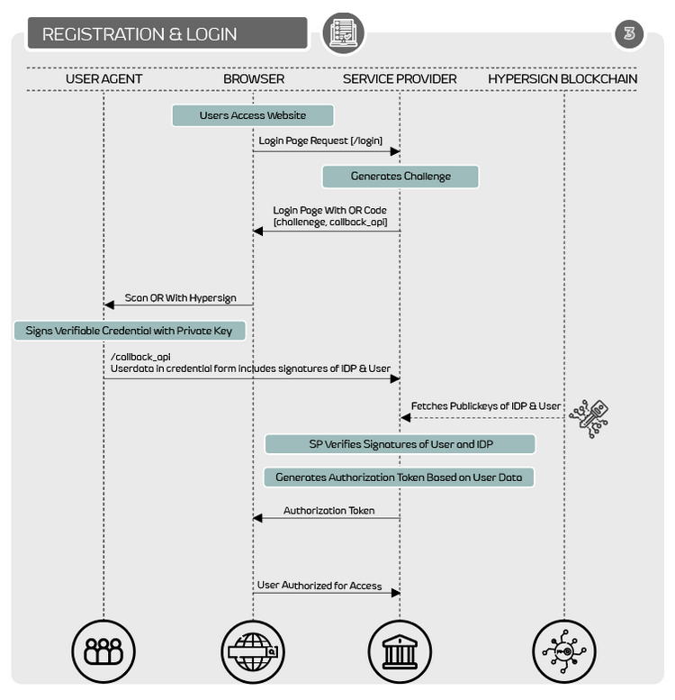

# Hypersign Authentication using JavaScript SDK

Hypersign is identity and access management infrastructure that ensures your employess and customers are really who they say they are. By combining biometric with the blockchian, it offers passwordless authentication, authorization, verification and intergrates in minutes.

Hypersign-auth-js-sdk is javascript based SDK to implement passworless authentication with any Nodejs web app. This SDK uses Websocket to communicate with client. 

<a href="https://www.producthunt.com/posts/hypersign-1?utm_source=badge-featured&utm_medium=badge&utm_souce=badge-hypersign-1" target="_blank"></a>



## The protocol



For more detials about Hypersign protocol, read the [developer documentation](https://www.docs.hypersign.id) or read our whitepaper at our [website](https://hypersign.id).

## Installation

```
npm i hypersign-auth-js-sdk --save
```

## Intergrate Hypersign Auth with Nodejs Application

To successfully intergrate Hypersign we need to do the following:

1. The app developer intergrates the Hypersign auth sdk with their nodejs backed
2. The app developer implement code to show QR code on the login page
3. Now the user will download [Hypersign Identity Mobile wallet]() and register himself. Upon registration, he will get HypersignAuth Credenital which he can use to login to websites which supports Hypersign login.

### Server Side

Import the package 

```js
const HypersignAuth = require('hypersign-auth-js-sdk')
```

Initialise the instance

```js
const options = {
    jwtSecret: process.env.JWTSECRET || 'vErySecureSec8@#',
    jwtExpiryTime: process.env.JWTEXPTIME || 240000, // in ms
    hsNodeUrl: 'http://localhost:5000',
    hsAppId: 'XXX-XXXX-XXX', // Get API key by loggin into HS studio
    hsAppSecret: 'XXX-XXXX-XXX' // Get API secte by loggin into HS studio
};

const hypersign = new HypersignAuth({
    server, // http server,
    baseUrl: 'http://localhost:4006', // the nodejs backend url
    options
});
```

Expose `/hs/api/v2/auth` API and and use `hypersign.authenticate` middleware.

```js
// Implement /hs/api/v2/auth API 
app.post('/hs/api/v2/auth', hypersign.authenticate.bind(hypersign), (req, res) => {
    try {
        const user = req.body.hsUserData;
        // Do something with the user data.
        res.status(200).send({ status: 200, message: "Success", error: null });
    } catch (e) {
        res.status(500).send({ status: 500, message: null, error: e.message });
    }
})
```

Now protect your resources using `hypersign.authorize` middlerware. Take a look at the example;

```js
app.get('/protected', hypersign.authorize.bind(hypersign), (req, res) => {
    try {
        const user = req.body.userData;
        // Do whatever you want to do with it
        res.status(200).send("I am protected by secure Hypersign authentication");
    } catch (e) {
        res.status(500).send(e.message)
    }
})
```

Make sure to pass hsAuthorization token in  `x-auth-token` header when making the protected resource call.

### Client Side

At first add a div.

```html
<body>
    <div id="qrcode"></div>
</body>
```

Then implement Websocket communication code.

```js
<script>
let ws = new WebSocket(`ws://${window.location.host}`);
ws.onmessage = function({data }) {
    let messageData = JSON.parse(data);
    $("#qrcode").html("");
    if (messageData.op == 'init') {
        $("#qrcode").qrcode({ "width": 100, "height": 100, "text": messageData.data });
    } else if (messageData.op == 'end') {
        ws.close();
        $("#qrcode").hide();
        const authorizationToken = messageData.data.token;
        // This will be the authorization token you get once you are verified 
    }
};
</script>
```
Get the complete implemetation demo [here](demo/README.md). You can also get detials about the Hypersign protocol from Product hunt or from our [website](https://hypermine.in/hypersign)


